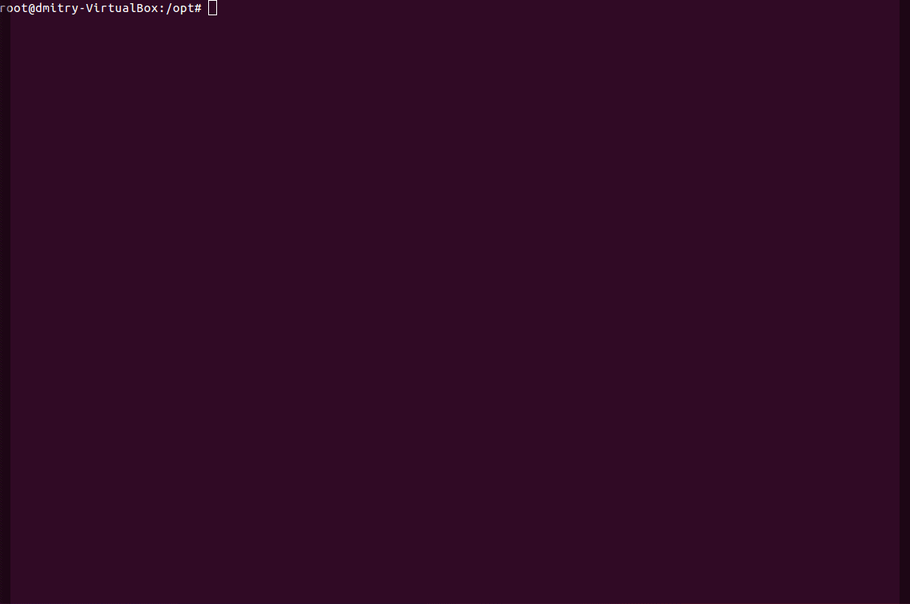
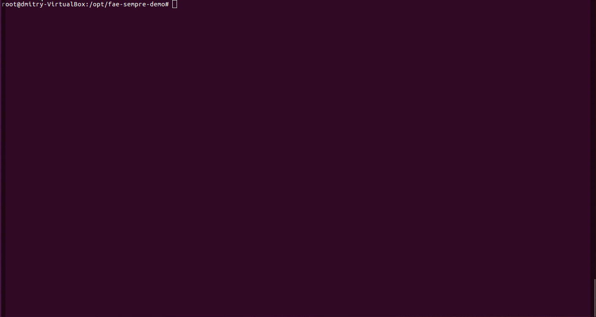

# FAE SEMPRE DEMO PROJECT

## how to use
* clone the project
* install docker-compose
* run: docker-compose run fae
* cli would appear for further instructinos

## simple demo try
* current demo present logic for template contract "grammars/contract.grammar"
* changing yml, any other grammar could be checked as well
* run: docker-compose run fae
* in cli write: (file /opt/examples/contract_example.txt)
* result is solidity contract

## current features
* fast grammar adaptation
* interactive learning

## basic training
* we will change text in example
* try to run again
* system will point on error in code
* we will solve it with training method and run again

